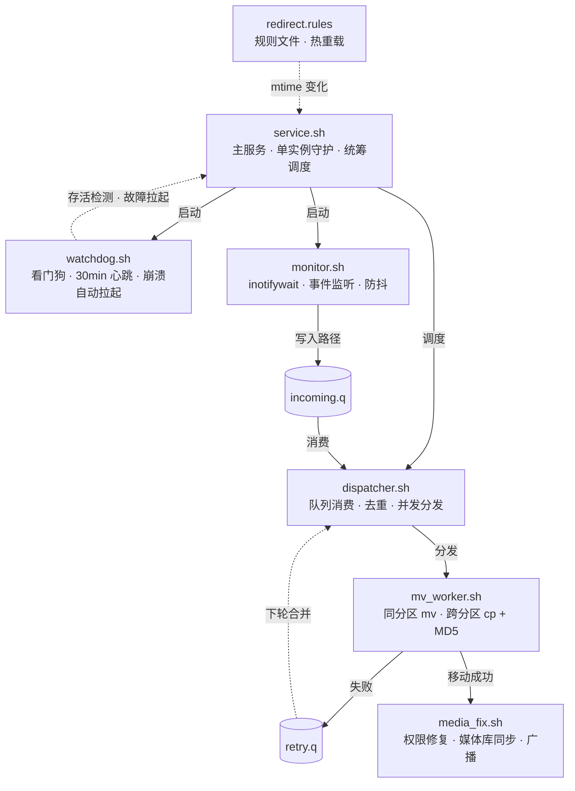

# 文件重定向（File Redirector）

> 一个运行于 Android root 环境的自动化文件管理模块，用于解决应用随意将文件写入不规范目录的问题，实现存储空间的规范与整洁。本模块基于 inotifywait 事件驱动构建：监控、调度、搬运三层解耦架构，空闲时功耗极低。

---

## 环境要求

- Android 设备（已 root）
- KernelSU / Magisk / APatch（任一框架均可）
- 支持 WebUI 将会获得最佳体验

---

## 使用方法

1. 在 KernelSU / Magisk / APatch 管理器中刷入模块 zip 包
2. 重启设备
3. 打开 ROOT 管理器 → 模块 → 点击「文件重定向」的 WebUI 按钮
4. 在规则页面添加重定向或清理规则，保存后自动生效

---

## 规则配置

规则文件位于模块目录下的 `redirect.rules`，可通过模块内置 WebUI 编辑，也可以直接用文本编辑器修改。

每条规则格式如下：

```
源目录|文件名匹配模式|目标目录
```

**说明：**

- 路径支持 `/sdcard/`、`/storage/emulated/0/` 等常见写法，模块内部会自动规范化
- 文件名匹配模式支持 `*`（任意字符）和 `?`（单个字符）通配符，留空或填 `*` 表示匹配全部文件
- `#` 开头的行为注释
- 规则仅匹配源目录本身，不递归匹配子目录

**示例：**

```
# 将相机目录下所有文件移动到备份目录
/sdcard/DCIM/Camera|*|/sdcard/Pictures/Backup

# 只移动 jpg 文件
/sdcard/DCIM/Camera|*.jpg|/sdcard/Pictures/Backup

# 移动特定前缀的文件
/sdcard/DCIM/Camera|example_*|/sdcard/Pictures/Camera
```

规则文件修改后无需重启，模块会自动检测变更并热重载。

---

## 项目架构



---

## 架构特性

| 特性 | 说明 |
|------|------|
| 事件驱动 | 基于 inotifywait 内核事件，无事件时进程休眠，空闲时 CPU 占用接近零 |
| 三层解耦 | 监控、调度、搬运完全独立，单层故障不影响其他层，便于定位故障和维护 |
| 队列原子交换 | dispatcher 消费时原子换出队列文件，monitor 同时继续写入不阻塞 |
| 并发自适应 | worker 并发数按 CPU 核心数自动计算，下限 2，上限 16 |
| 跨分区安全 | 跨分区移动经大小与 MD5 双重校验后方删除源文件，保证数据安全 |

---

## 免责声明
- 本项目仅供合法学习与技术交流，禁止用于任何违规、侵权、恶意用途。
- 使用本项目所产生的一切设备、数据损失及相关责任，由使用者自行承担。

---

## 许可证

本项目基于 [GNU General Public License v3.0](LICENSE) 开源。
